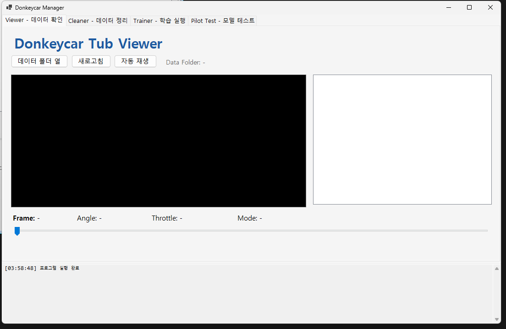
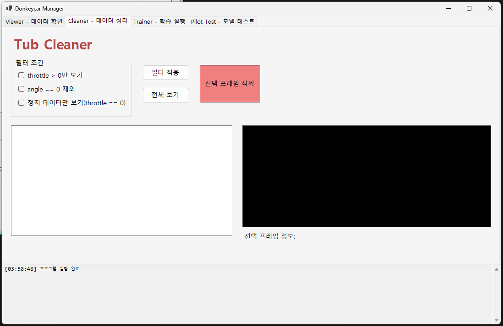
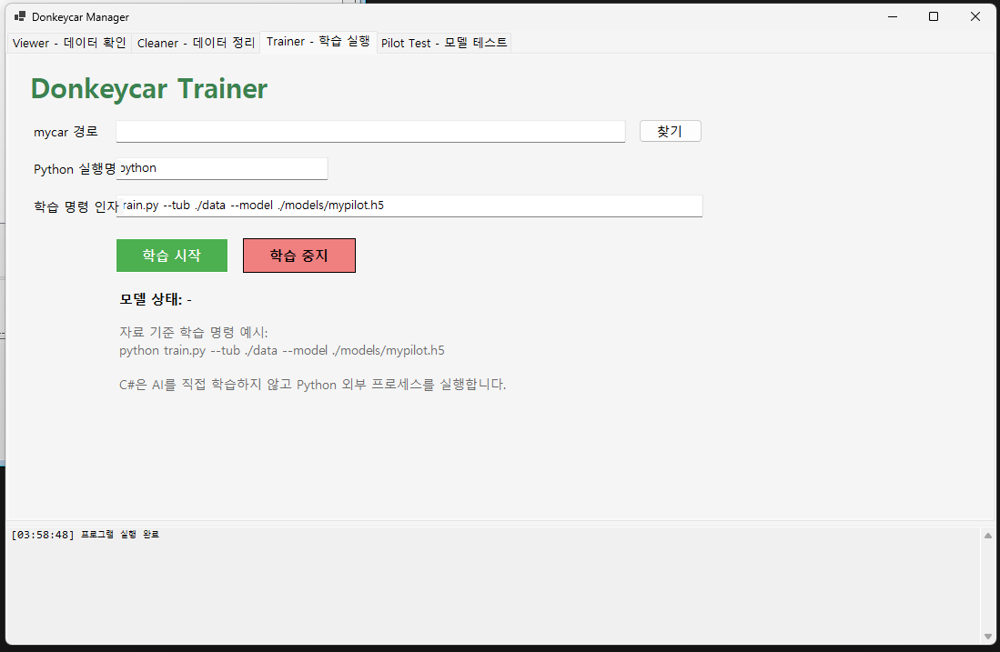
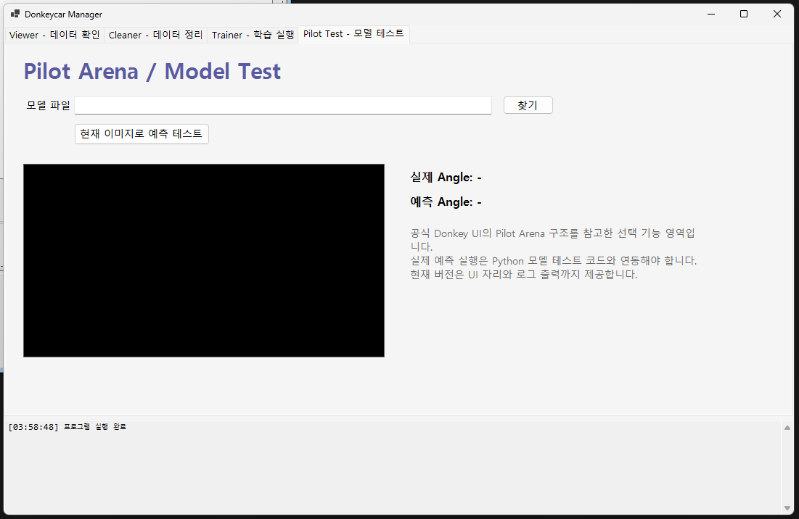

````markdown
# Donkeycar Manager

## 개요
  - Donkeycar Manager는 Donkeycar에서 수집한 주행 데이터를 확인하고 정리하기 위해 만든 C# WinForms 기반 데이터 관리 UI 프로그램입니다.
  - Donkeycar 데이터는 카메라 이미지와 각 이미지에 연결된 조향값(angle), 스로틀값(throttle), 주행 모드(mode)로 구성됩니다.
  - 본 프로그램은 `catalog_0.catalog` 파일과 `images` 폴더를 읽어 프레임별 이미지와 주행 데이터를 시각적으로 확인할 수 있도록 구현하였습니다.
  - 또한 필터링, 선택 프레임 삭제, Python 학습 명령 실행, 로그 출력 기능을 포함하여 Donkeycar 데이터 관리 흐름을 하나의 UI에서 처리할 수 있도록 구성하였습니다.

- 사용한 개발 환경:
  - C#
  - .NET Windows Forms
  - Visual Studio
  - Donkeycar 데이터셋
  - Python / Donkeycar 학습 명령

- 참고한 UI 구조:
  - 공식 Donkey UI의 Tub Manager 구조를 참고하여 Viewer 탭을 구성하였습니다.
  - 공식 Donkey UI의 Tub Cleaner 구조를 참고하여 Cleaner 탭을 구성하였습니다.
  - 공식 Donkey UI의 Trainer 구조를 참고하여 Trainer 탭을 구성하였습니다.
  - 공식 Donkey UI의 Pilot Arena 구조를 참고하여 Pilot Test 탭을 구성하였습니다.

- Donkeycar 데이터 구조:
  - Donkeycar 데이터는 `data` 폴더 안에 저장됩니다.
  - `data/images` 폴더에는 카메라 이미지가 저장됩니다.
  - `data/catalog_0.catalog` 파일에는 각 이미지와 연결된 조향값, 스로틀값, 모드 정보가 저장됩니다.
  - catalog 파일은 한 줄이 하나의 프레임을 의미하는 JSON Lines 형식입니다.

```text
data/
├── images/
│   ├── 0_cam_image_array_.jpg
│   ├── 1_cam_image_array_.jpg
│   └── ...
└── catalog_0.catalog
````

* 주요 기능:

  * Donkeycar data 폴더 열기
  * `catalog_0.catalog` 파일 읽기
  * 이미지 표시
  * angle / throttle / mode 값 표시
  * TrackBar를 이용한 프레임 이동
  * ListBox를 이용한 특정 프레임 선택
  * 자동 재생 기능
  * throttle 조건 필터링
  * angle 조건 필터링
  * 정지 데이터 필터링
  * 선택 프레임 삭제
  * Python 학습 명령 실행
  * 학습 로그 출력
  * 모델 파일 선택 및 테스트 UI 제공

## UI 구성

* 전체 화면 구성:

  * 프로그램은 `Viewer`, `Cleaner`, `Trainer`, `Pilot Test` 네 개의 탭으로 구성하였습니다.
  * 각 탭은 Donkeycar 데이터 관리 흐름에 맞춰 데이터 확인, 데이터 정리, 학습 실행, 모델 테스트 순서로 나누었습니다.
  * 전체 UI는 공식 Donkey UI의 Tub Manager, Tub Cleaner, Trainer, Pilot Arena 구조를 참고하여 구성하였습니다.

* Viewer 탭:

  * Donkeycar 데이터셋을 불러오고 프레임별 이미지를 확인하는 화면입니다.
  * 상단에는 데이터 폴더 열기, 새로고침, 자동 재생 버튼을 배치하였습니다.
  * 중앙 왼쪽에는 현재 프레임 이미지를 표시하는 PictureBox를 배치하였습니다.
  * 중앙 오른쪽에는 전체 프레임 목록을 표시하는 ListBox를 배치하였습니다.
  * 이미지 아래에는 Frame, Angle, Throttle, Mode 값을 표시하는 Label을 배치하였습니다.
  * 하단에는 프레임 이동을 위한 TrackBar를 배치하였습니다.

* Cleaner 탭:

  * 불필요하거나 잘못된 데이터를 필터링하고 삭제하는 화면입니다.
  * `throttle > 0만 보기`, `angle == 0 제외`, `정지 데이터만 보기` 필터를 제공하였습니다.
  * 필터 적용 버튼을 통해 조건에 맞는 프레임만 표시할 수 있도록 구현하였습니다.
  * 전체 보기 버튼을 통해 필터를 해제하고 모든 프레임을 다시 볼 수 있도록 구현하였습니다.
  * 선택 프레임 삭제 버튼을 통해 현재 선택한 프레임의 이미지 파일과 catalog 데이터를 삭제할 수 있도록 구현하였습니다.
  * 삭제 전 확인 메시지를 띄워 실수로 데이터를 삭제하는 것을 방지하였습니다.
  * 선택한 프레임을 미리 볼 수 있도록 Cleaner 탭에도 PictureBox를 배치하였습니다.

* Trainer 탭:

  * Python 학습 명령을 실행하기 위한 화면입니다.
  * mycar 경로, Python 실행명, 학습 명령 인자를 입력할 수 있도록 구성하였습니다.
  * 기본 학습 명령 인자는 `train.py --tub ./data --model ./models/mypilot.h5`로 설정하였습니다.
  * 학습 시작 버튼을 누르면 C#에서 Python 외부 프로세스를 실행하도록 구현하였습니다.
  * 학습 중지 버튼을 통해 실행 중인 학습 프로세스를 중지할 수 있도록 구현하였습니다.
  * 학습 로그는 하단 로그창에 출력되도록 구현하였습니다.
  * `mycar/models/mypilot.h5` 파일 존재 여부를 확인하여 모델 상태를 표시하도록 구성하였습니다.

* Pilot Test 탭:

  * 학습된 모델을 이용한 테스트 기능을 확장하기 위한 화면입니다.
  * 모델 파일 `.h5`를 선택할 수 있는 입력 영역을 구성하였습니다.
  * 현재 Viewer에서 선택한 이미지를 테스트 대상으로 사용할 수 있도록 구성하였습니다.
  * 실제 angle 값과 예측 angle 값을 비교해서 표시할 수 있는 UI를 배치하였습니다.
  * 현재 버전에서는 Python 예측 연동 전 단계로, 모델 테스트를 위한 UI 구조와 로그 출력 기능을 먼저 구현하였습니다.

* 로그 출력 영역:

  * 프로그램 하단에는 공통 로그 출력창을 배치하였습니다.
  * 데이터 로드, 필터 적용, 삭제 완료, 학습 시작, 학습 종료, 오류 메시지를 로그창에 출력하도록 구현하였습니다.

## 사용 방법

* 1단계: Donkeycar 데이터 준비

  * Donkeycar에서 수집한 `data` 폴더를 준비합니다.
  * `data` 폴더 안에는 `images` 폴더와 `catalog_0.catalog` 파일이 있어야 합니다.
  * `mycar` 폴더 안에 있는 `data` 폴더를 사용합니다.

* 2단계: 프로그램 실행

  * Visual Studio에서 프로젝트를 실행합니다.
  * 프로그램이 실행되면 Donkeycar Manager 창이 열립니다.
  * 하단 로그창에 프로그램 실행 로그가 표시됩니다.

* 3단계: 데이터 폴더 열기

  * Viewer 탭에서 `데이터 폴더 열기` 버튼을 클릭합니다.
  * `mycar` 폴더가 아니라 `mycar/data` 폴더를 선택합니다.
  * 정상적으로 로드되면 첫 번째 이미지와 angle, throttle, mode 값이 표시됩니다.
  * 오른쪽 ListBox에는 전체 프레임 목록이 표시됩니다.

* 4단계: 프레임 탐색

  * 오른쪽 ListBox에서 원하는 프레임을 클릭하면 해당 이미지와 데이터가 표시됩니다.
  * 하단 TrackBar를 움직이면 프레임을 빠르게 이동할 수 있습니다.
  * 자동 재생 버튼을 누르면 프레임이 영상처럼 자동으로 넘어갑니다.
  * 자동 재생 중에는 버튼 이름이 `자동 재생 중지`로 바뀌며, 다시 누르면 자동 재생이 멈춥니다.

* 5단계: 데이터 필터링

  * Cleaner 탭으로 이동합니다.
  * 원하는 필터 조건을 체크합니다.
  * 필터 적용 버튼을 클릭하면 조건에 맞는 프레임만 표시됩니다.
  * 전체 보기 버튼을 클릭하면 필터가 해제되고 전체 데이터가 다시 표시됩니다.

* 6단계: 데이터 삭제

  * 삭제할 프레임을 Viewer 또는 Cleaner에서 선택합니다.
  * Cleaner 탭에서 선택 프레임 삭제 버튼을 클릭합니다.
  * 확인창에서 예를 누르면 해당 프레임의 이미지 파일과 catalog 정보가 삭제됩니다.
  * 실제 파일이 삭제되므로, 테스트 전 data 폴더를 백업하는 것이 좋습니다.

* 7단계: 학습 실행

  * Trainer 탭으로 이동합니다.
  * mycar 경로를 선택합니다.
  * Python 실행명과 학습 명령 인자를 확인합니다.
  * 학습 시작 버튼을 클릭합니다.
  * 하단 로그창에서 학습 진행 상황을 확인합니다.
  * 학습이 완료되면 `mycar/models/mypilot.h5` 파일 생성 여부를 확인합니다.
  * 실행 중인 학습을 멈추고 싶으면 학습 중지 버튼을 클릭합니다.

* 8단계: 모델 테스트

  * Pilot Test 탭으로 이동합니다.
  * 모델 파일을 선택합니다.
  * Viewer에서 테스트할 프레임을 선택한 뒤 현재 이미지로 예측 테스트 버튼을 클릭합니다.
  * 현재 버전에서는 실제 예측 Python 연동 전 단계이며, 실제 angle 값과 예측 결과를 표시할 수 있는 UI 구조를 제공합니다.

## 실행 화면

* Viewer 탭 실행 화면:

  * 데이터 폴더를 열고 이미지, angle, throttle, mode 값을 확인하는 화면입니다.



* Cleaner 탭 실행 화면:

  * 필터 적용과 선택 프레임 삭제를 수행하는 화면입니다.



* Trainer 탭 실행 화면:

  * Python 학습 명령을 실행하고 로그를 확인하는 화면입니다.



* Pilot Test 탭 실행 화면:

  * 모델 파일 선택과 예측 테스트 UI를 제공하는 화면입니다.



## 구현 기능 상세

* catalog 파일 읽기:

  * `File.ReadLines()`를 이용하여 `catalog_0.catalog` 파일을 한 줄씩 읽습니다.
  * `System.Text.Json`을 사용하여 각 줄의 JSON 데이터를 `DonkeyFrame` 객체로 변환합니다.
  * 변환한 프레임 데이터를 리스트에 저장하여 UI에서 사용합니다.

* 이미지 표시:

  * catalog에 저장된 `cam/image_array` 값을 기준으로 `images` 폴더 안의 이미지 파일 경로를 구성합니다.
  * `PictureBox`를 이용하여 현재 프레임 이미지를 표시합니다.
  * 이미지 파일 잠김 문제를 줄이기 위해 파일을 byte 배열로 읽은 뒤 Bitmap으로 변환하여 표시합니다.

* 프레임 이동:

  * TrackBar의 값을 현재 프레임 인덱스로 사용합니다.
  * 슬라이더 이동 시 해당 프레임의 이미지와 angle, throttle, mode 값을 동시에 갱신합니다.

* 리스트 선택:

  * ListBox에 전체 프레임 정보를 표시합니다.
  * 사용자가 특정 프레임을 클릭하면 해당 프레임으로 이동합니다.
  * Viewer 탭과 Cleaner 탭의 선택 프레임이 서로 연결되도록 구성하였습니다.

* 자동 재생:

  * Timer를 이용하여 일정 시간마다 다음 프레임으로 이동하도록 구현하였습니다.
  * 사용자는 자동 재생 버튼을 통해 프레임을 영상처럼 확인할 수 있습니다.

* 필터 기능:

  * `throttle > 0` 조건을 이용해 움직임이 있는 데이터만 볼 수 있습니다.
  * `angle == 0 제외` 조건을 이용해 조향 변화가 없는 데이터를 제외할 수 있습니다.
  * `throttle == 0` 조건을 이용해 정지 데이터만 따로 볼 수 있습니다.

* 삭제 기능:

  * 선택한 프레임의 이미지 파일을 삭제합니다.
  * catalog 리스트에서도 해당 프레임 정보를 제거합니다.
  * 삭제 후 `catalog_0.catalog` 파일을 다시 저장합니다.
  * 삭제 전 확인 메시지를 띄워 실수로 삭제하는 것을 방지하였습니다.

* 학습 실행:

  * `ProcessStartInfo`를 사용하여 Python 학습 명령을 외부 프로세스로 실행합니다.
  * 표준 출력과 오류 출력을 로그창에 표시합니다.
  * 학습이 끝나면 `models` 폴더의 `mypilot.h5` 생성 여부를 확인합니다.

* 학습 중지:

  * 실행 중인 Python 학습 프로세스가 있을 경우 중지할 수 있도록 구현하였습니다.
  * 장시간 학습이 진행될 때 사용자가 직접 중단할 수 있습니다.

* 모델 상태 확인:

  * 선택한 mycar 경로 안에 `models/mypilot.h5` 파일이 있는지 확인합니다.
  * 파일이 있으면 모델 상태에 존재 여부를 표시합니다.

* 모델 테스트:

  * 모델 파일 선택 UI를 제공합니다.
  * 현재 선택된 프레임의 실제 angle 값을 표시합니다.
  * 추후 Python 예측 코드와 연동하여 예측 angle 값을 표시할 수 있도록 UI 구조를 구성하였습니다.

## 코드 구조

* Program.cs:

  * 프로그램 시작 지점입니다.
  * `MainForm`을 실행합니다.

* DonkeyFrame.cs:

  * Donkeycar catalog 한 줄의 데이터를 담는 클래스입니다.
  * `_index`, `_session_id`, `_timestamp_ms`, `cam/image_array`, `user/angle`, `user/mode`, `user/throttle` 값을 저장합니다.

* MainForm.Designer.cs:

  * WinForms 디자인 코드입니다.
  * Viewer, Cleaner, Trainer, Pilot Test 탭과 각종 버튼, Label, PictureBox, ListBox, TrackBar, TextBox를 배치합니다.
  * Visual Studio 디자인창에서 UI를 확인할 수 있도록 구성하였습니다.

* MainForm.cs:

  * 실제 기능 코드입니다.
  * 데이터 로딩, 이미지 표시, 프레임 이동, 필터, 삭제, 학습 실행, 로그 출력 기능을 처리합니다.

