# 🚗 Donkeycar Manager

<div align="center">


Donkeycar 자율주행 데이터를 Windows에서 직접 관리하고,<br>모델을 학습하고, 실시간으로 예측 성능을 검증하는 **통합 관리 도구**입니다.

</div>

---

## 🚀 시작 화면

> 

앱을 실행하면 작업 유형을 선택하는 시작 화면이 나타납니다. 세 버튼 중 하나를 클릭하면 해당 탭이 바로 열립니다. 버튼에 마우스를 올리면 부드러운 hover 애니메이션이 재생됩니다.

| 버튼 | 색상 | 이동 탭 |
|------|------|--------|
| 데이터 정리 | 🟢 초록 | 데이터 정리 탭 |
| 학습 실행 | 🟡 노란 | 학습 실행 탭 |
| 모델 테스트 | 🔴 빨간 | 모델 테스트 탭 |

---

## 🖥️ 전체 화면 구성

```
┌──────────────────────────────────────────────────────┐
│   [ 데이터 정리 ]   [ 학습 실행 ]   [ 모델 테스트 ]     │  ← 탭
├──────────────────────────────────────────────────────┤
│                       탭 내용                         │
├──────────────────────────────────────────────────────┤  ← 드래그로 높이 조절
│   [HH:MM:SS] 로그 메시지 ...                          │  ← 로그 패널
└──────────────────────────────────────────────────────┘
```

하단 로그 패널은 모든 작업의 결과를 타임스탬프와 함께 실시간으로 출력합니다. 구분선을 **위아래로 드래그**해 높이를 조절할 수 있으며, 최대 **500줄**까지 유지됩니다.

---

## 🗂️ 탭 1 — 데이터 정리

> 

Donkeycar 주행 데이터를 불러와 시각적으로 확인하고, 불필요한 데이터를 필터링·삭제합니다.

<br>

### 📁 데이터 폴더 열기

> 

폴더를 여는 방법은 세 가지입니다.

- **📁 버튼 클릭** — 폴더 선택 다이얼로그로 `mycar/data` 폴더 선택
- **드래그 앤 드롭** — `data` 폴더를 앱 창 또는 경로 입력창 위로 드래그
- **✕ 버튼** — 현재 폴더 해제 및 초기화

폴더가 열리면 catalog 파일을 자동으로 파싱하고 데이터 요약을 로그에 출력합니다.

```
[16:04:21] 로드 완료: 16369개 프레임 / catalog 파일 17개 / 전체 줄 16369개
[16:04:21] 전체 프레임 수: 16369개 | 정지 프레임: 832개 (5.1%) | 직진 프레임: 4201개
[16:04:21] 평균 핸들 각도: 0.0312 | 평균 속도: 0.2814
```

<br>

### 🖼️ 이미지 뷰어

> 

선택한 프레임의 카메라 이미지가 크게 표시됩니다. 상단에는 해당 프레임의 **인덱스, 핸들각도(angle), 속도(throttle), 모드** 정보가 실시간으로 표시됩니다.

<br>

### 🎨 이미지 조작

> 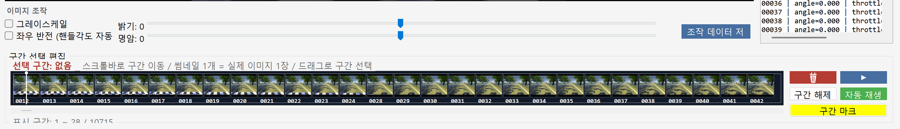

| 컨트롤 | 기능 |
|--------|------|
| ☑️ 그레이스케일 | 이미지를 흑백으로 변환 |
| ☑️ 좌우 반전 | 이미지 좌우 반전 (catalog의 핸들각도 값도 자동 반전) |
| 밝기 슬라이더 | -100 ~ +100 범위로 밝기 조절 |
| 명암 슬라이더 | -100 ~ +100 범위로 명암 조절 |

**조작 데이터 저장** 버튼을 누르면 현재 설정을 전체 이미지에 일괄 적용해 `data/processed/` 폴더에 새 데이터셋으로 저장합니다.

<br>

### 🔍 필터 조건

> 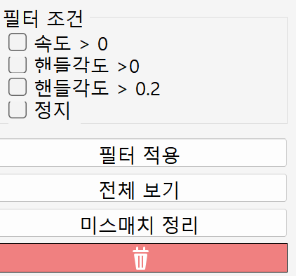

| 필터 | 조건 |
|------|------|
| 속도 > 0 | throttle이 0보다 큰 프레임만 표시 |
| 핸들각도 > 0 | angle이 0이 아닌 프레임만 표시 |
| 핸들각도 > 0.2 | 미세한 떨림(jitter) 제거, 명확한 조향 데이터만 표시 |
| 정지 | throttle이 0인 정지 프레임만 표시 |

> 💡 필터 적용 상태에서 삭제 버튼을 누르면 **"화면에 안 보이는 데이터 N개를 삭제하시겠습니까?"** 확인창이 먼저 떠서 걸러진 데이터를 한 번에 정리할 수 있습니다.

<br>

### 📋 프레임 리스트

> 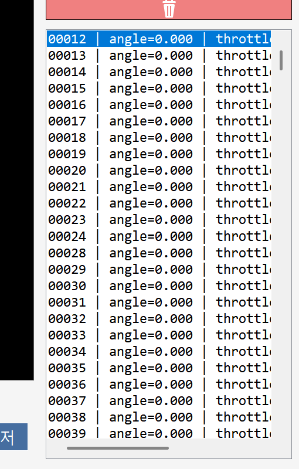

필터 조건이 적용된 프레임 목록이 오른쪽 리스트에 표시됩니다. 항목을 클릭하면 해당 이미지가 뷰어에 표시되며, `Ctrl+클릭` / `Shift+클릭`으로 여러 항목을 동시에 선택할 수 있습니다.

```
00198 | angle=0.800 | throttle=0.050 | mode=user
```

<br>

### 🗑️ 데이터 삭제 & ↩️ 되돌리기

> 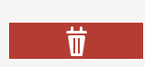   

**삭제** — 삭제 전 `data/backup/yyyyMMdd_HHmmss/` 폴더에 자동 백업이 생성됩니다. 이미지 파일과 catalog 데이터가 함께 삭제되며 catalog는 자동으로 재작성됩니다.

**되돌리기** — 버튼을 클릭하면 이전 백업 시점 목록이 팝업으로 표시됩니다. 원하는 시점을 선택해 복원할 수 있으며, 복원 전 경고 메시지가 표시됩니다.

> ⚠️ 복원 후에는 **현재 상태로 다시 돌아올 수 없습니다.** 백업 목록은 앱 재시작 후에도 유지됩니다.

<br>

### 🔧 미스매치 정리

catalog에 등록된 항목과 실제 이미지 파일 간의 불일치를 자동으로 감지하고 정리합니다.

| 케이스 | 처리 방식 |
|--------|----------|
| catalog에 있는데 이미지 없음 | catalog에서 해당 줄 제거 |
| 이미지는 있는데 catalog에 없음 | `data/mismatch_trash/`로 격리 이동 (삭제 아님) |
| 정리 전 | catalog 원본 자동 백업 |

<br>

### ⏱️ 구간 선택 편집 — 타임라인

> 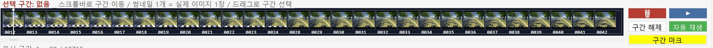

화면 하단의 타임라인에서 썸네일을 보며 구간을 선택하고 편집할 수 있습니다. 썸네일 하나가 실제 이미지 1장에 해당하며, 하단 스크롤바로 전체 데이터를 좌우로 탐색합니다.

**드래그로 구간 선택**

> 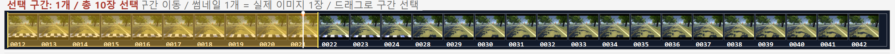

타임라인에서 드래그하면 구간이 노란색 반투명으로 강조됩니다. 여러 구간을 반복해서 추가할 수 있습니다.

**구간 마크 모드** — 자동 재생 중 스페이스바로 마크

> 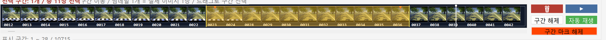

1. **구간 마크** 버튼 클릭 → 버튼이 빨간색으로 변함
2. **자동 재생** 버튼으로 재생 시작
3. 시작 지점에서 `Space` 또는 클릭 → 시작점 지정
4. 끝 지점에서 `Space` 또는 클릭 → 끝점 지정 및 구간 추가
5. 타임라인에 **빨간색 삼각형(▼)** 마커 표시

**버튼 설명**

| 버튼 | 기능 |
|------|------|
| 🗑️ 빨간 버튼 | 선택 구간의 모든 프레임 삭제 |
| ▶ 파란 버튼 | 선택 구간만 재생 / 일시정지 |
| 구간 해제 | 선택 구간 전체 초기화 |
| 자동 재생 | 전체 데이터 자동 재생 토글 |

---

## 🧠 탭 2 — 학습 실행

> 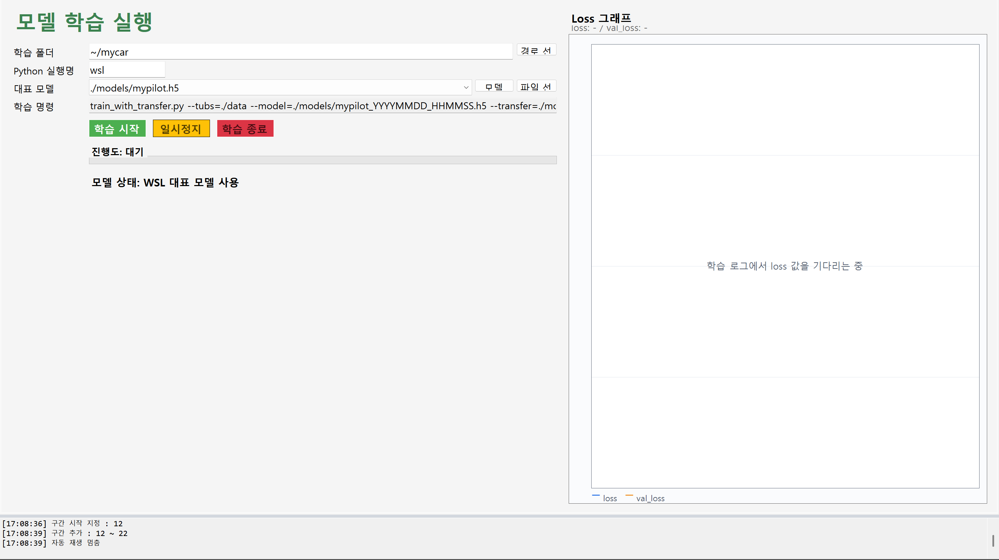

WSL2(Ubuntu-22.04) + Conda 환경에서 Donkeycar 모델을 전이학습시키는 탭입니다.

<br>

### ⚙️ 학습 설정

> 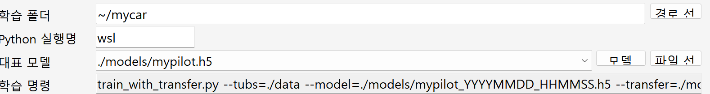

| 항목 | 설명 |
|------|------|
| 학습 폴더 | mycar 폴더 경로 (WSL: `~/mycar` / Windows: 직접 선택) |
| Python 실행명 | WSL 사용 시 `wsl`, 직접 실행 시 `python` |
| 대표 모델 | 전이학습 기본 모델 (`.h5` / `.keras`) |
| 학습 명령 | 자동 생성되는 학습 커맨드 (읽기 전용) |

- **모델 스캔** — WSL `~/mycar/models/`를 스캔해 드롭다운 목록 업데이트 (최신 수정순 정렬)
- **파일 선택** — 파일 선택 다이얼로그로 직접 모델 선택

<br>

### ▶️ 학습 실행 및 제어

> 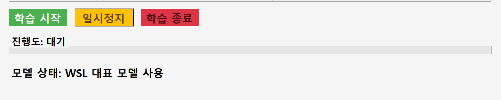

| 버튼 | 기능 |
|------|------|
| 🟢 학습 시작 | 전이학습 스크립트 자동 생성 후 WSL에서 학습 시작 |
| 🟡 일시정지 | 학습 일시정지 (WSL: SIGSTOP / Windows: NtSuspendProcess) |
| 🔴 학습 종료 | SIGINT → SIGTERM → SIGKILL 순으로 안전 종료, 최신 모델 자동 반영 |

진행도 바에 현재 Epoch와 step이 실시간으로 표시됩니다.

```
진행도: Epoch 3/50 / 120/240 (50%)
```

<br>

### 📈 Loss 그래프

> 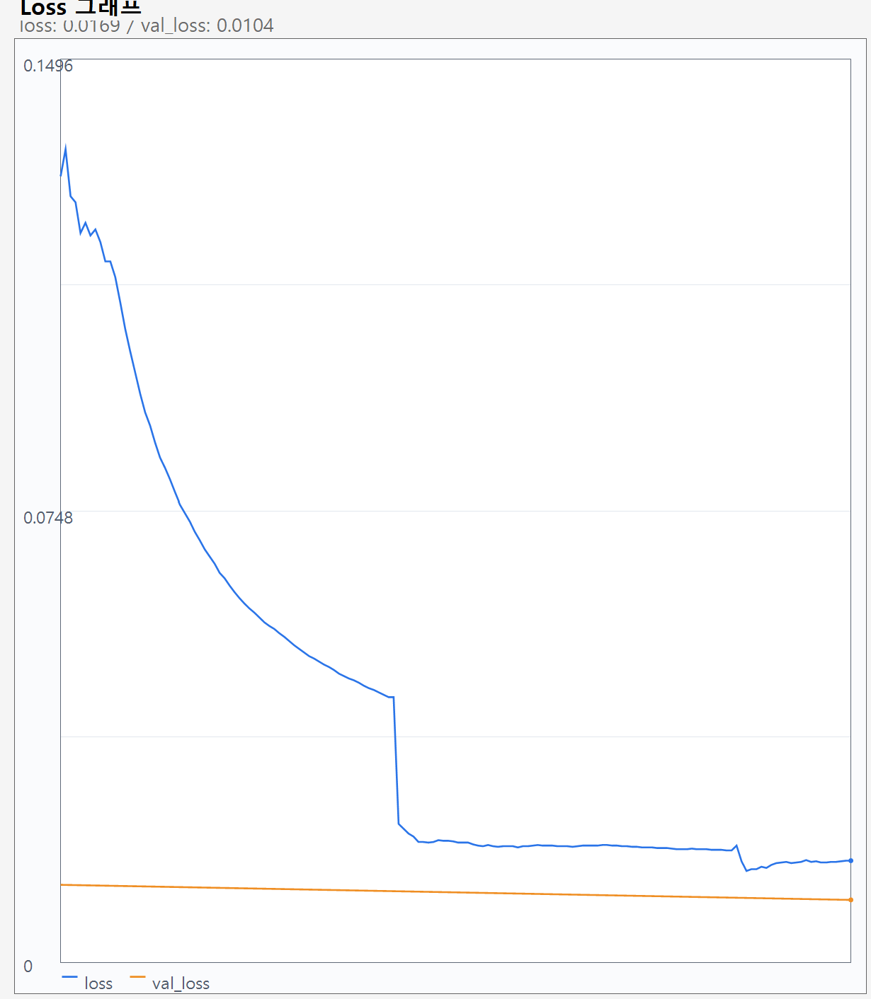

학습 로그에서 `loss`와 `val_loss`를 자동 파싱해 실시간으로 그래프를 그립니다.

| 선 | 의미 |
|----|------|
| 🔵 파란선 | 학습 loss |
| 🟠 주황선 | 검증 loss (val_loss) |

---

## 🎯 탭 3 — 모델 테스트

> 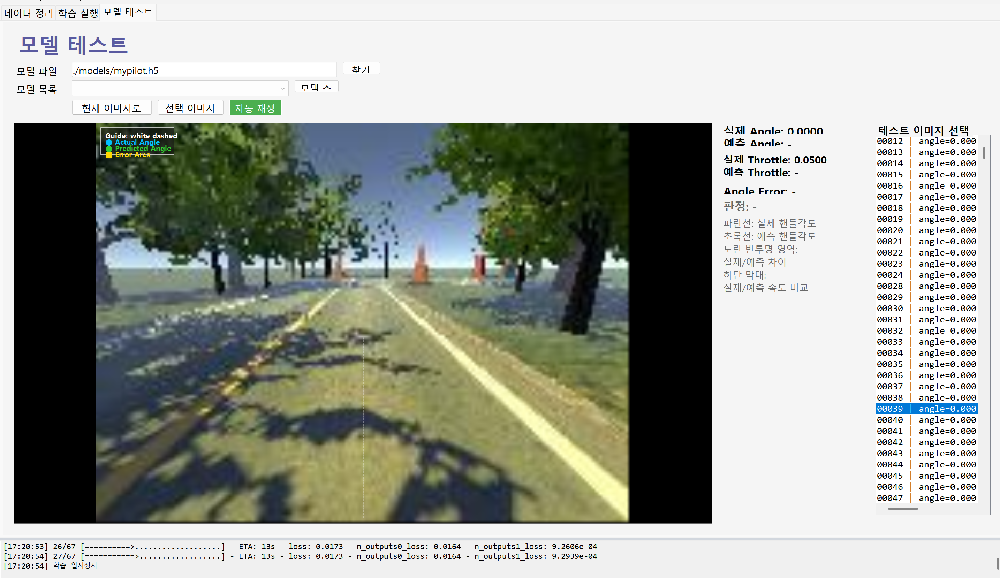

학습된 모델의 예측 성능을 실제 주행 이미지와 비교하는 탭입니다.

<br>

### 📂 모델 선택

> 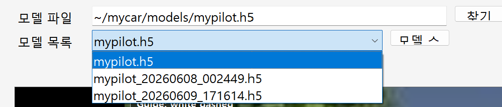

| 항목 | 설명 |
|------|------|
| 모델 파일 입력창 | 모델 경로 직접 입력 (WSL 경로 지원) |
| 찾기 버튼 | 파일 선택 다이얼로그로 모델 파일 선택 |
| 모델 목록 드롭다운 | WSL `~/mycar/models/`의 `.h5` 파일 목록 |
| 모델 스캔 버튼 | 모델 목록 다시 스캔 |

<br>

### 🔮 예측 테스트

> 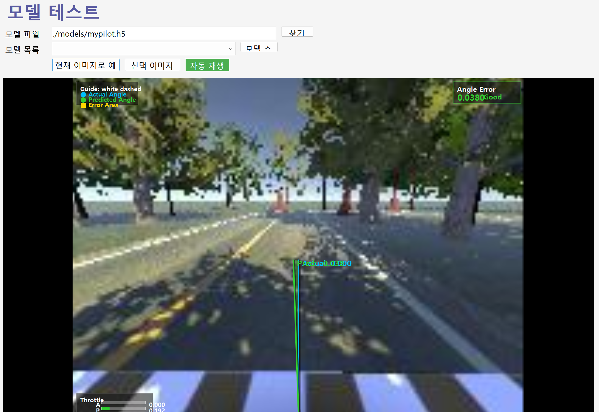

**현재 이미지로 예측 테스트** 버튼을 누르면 선택 프레임을 WSL 예측 서버(`predict_server.py`)로 전송해 핸들각도와 속도를 예측합니다.

**오버레이 요소**

| 요소 | 의미 |
|------|------|
| ⚪ 흰색 점선 | 중앙 기준선 (직진) |
| 🔵 파란선 (Actual) | 실제 핸들각도 방향 |
| 🟢 초록선 (Pred) | 예측 핸들각도 방향 |
| 🟡 노란 반투명 영역 | 실제와 예측의 오차 영역 |
| 📊 하단 막대 | 실제(A) / 예측(P) 속도 비교 |
| 🔲 우측 상단 패널 | Angle Error 수치 + 판정 |

**오차 판정 기준**

| 판정 | Angle Error | 색상 |
|------|------------|------|
| Good | 0.05 이하 | 🟢 초록 |
| Warning | 0.05 ~ 0.15 | 🟡 주황 |
| High Error | 0.15 초과 | 🔴 빨강 |

<br>


> 📸 **[사진: 자동 재생 중 실시간으로 예측선이 바뀌는 화면]**

**자동 재생** 버튼을 누르면 프레임을 자동으로 넘기며 각 프레임의 예측을 실시간으로 실행합니다. 예측 서버는 처음 한 번만 모델을 로드하고 이후 요청은 재사용합니다.

- **선택 이미지 사용** — 데이터 정리 탭에서 선택한 프레임을 그대로 사용
- **멈춤** — 자동 재생 즉시 정지

---

## 📁 데이터 구조

```
mycar/
└── data/
    ├── catalog_0.catalog       ← 주행 데이터 (JSON Lines, 1000개 단위 분할)
    ├── catalog_1.catalog
    ├── images/
    │   ├── 00000_cam_image_array_.jpg
    │   └── ...
    ├── backup/                 ← 삭제 시 자동 생성
    │   └── 20250608_160421/
    │       ├── catalog/
    │       └── images/
    ├── mismatch_trash/         ← 미스매치 정리 시 격리
    └── processed/              ← 조작 데이터 저장 시 생성
```

---

## 🛠️ 기술 스택

| 분류 | 내용 |
|------|------|
| 언어 | C# (.NET 10) |
| UI 프레임워크 | Windows Forms (WinForms) |
| 학습 환경 | WSL2 Ubuntu-22.04 + Conda (`e2e_env`) |
| 학습 프레임워크 | Donkeycar + TensorFlow/Keras |
| 예측 서버 | Python (`predict_server.py`) — stdin/stdout JSON 통신 |
| 모델 형식 | `.h5` (Keras), `.keras` |

---

## ⚠️ 주의사항

- 데이터 폴더는 `mycar/data` 폴더를 선택해야 합니다. (`mycar` 폴더 선택 시 오류 발생)
- WSL 모드에서는 `Ubuntu-22.04` 배포판과 `e2e_env` Conda 환경이 설치되어 있어야 합니다.
- 되돌리기 복원 후에는 복원 이전 상태로 다시 돌아갈 수 없습니다.
- 미스매치 정리 시 이미지는 삭제되지 않고 `mismatch_trash` 폴더로 이동됩니다.
- ## 🖥️ 개발 및 테스트 환경

### 앱 실행 환경 (Windows)
| 구분 | 항목 | 버전 |
|------|------|------|
| OS | Windows | 11 |
| 언어 | C# | 10 |
| 프레임워크 | .NET WinForms | 10 |

### 학습 / 예측 환경 (WSL2)
| 구분 | 항목 | 버전 |
|------|------|------|
| OS | Ubuntu (WSL2) | 22.04 |
| 언어 | Python | 3.11 |
| 패키지 관리 | Conda | e2e_env |
| ML 프레임워크 | TensorFlow / Keras | 2.x | 
| 라이브러리 | Donkeycar | v5.3.dev1 |

---


